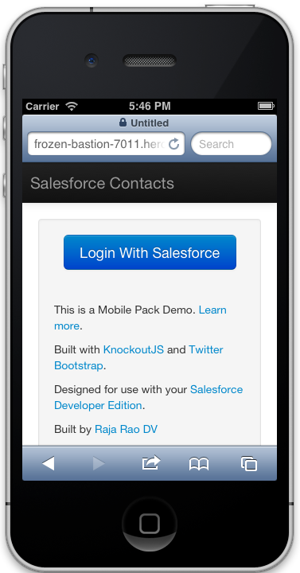
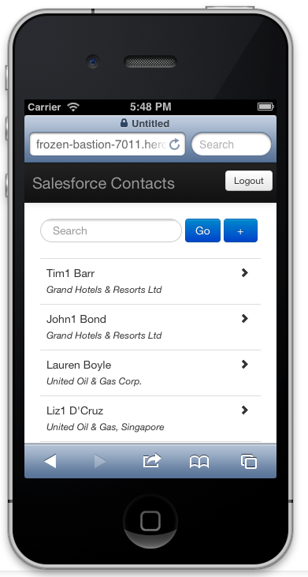
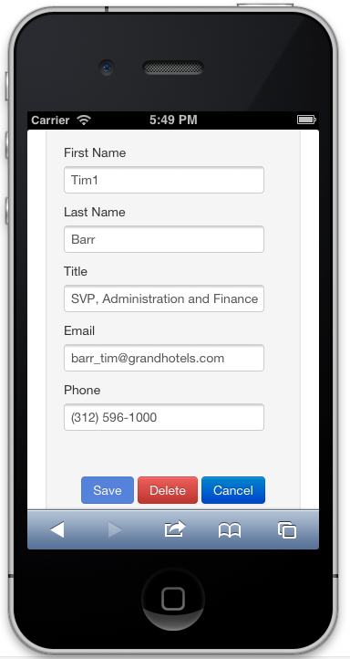
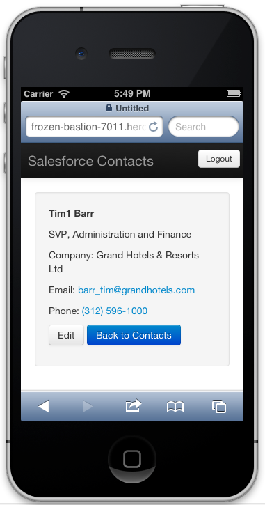

# MobilePack-KnockoutJS

  

## Overview
KnockoutJS MobilePack comes with all the necessary code for you to build Salesforce mobile apps using <a href="http://knockoutjs.com" target="_blank">KnockoutJS</a> JavaScript framework and UI frameworks like: Twitter's <a href="http://twitter.github.io/bootstrap/" target="_blank"> Bootstrap</a> and <a href="http://jquerymobile.com/" target="_blank">JQuery Mobile</a>. It also comes with sample apps that shows how to run such apps on various environments like <a href="http://wiki.developerforce.com/page/User_Interface" target="_blank">Salesforce Visualforce</a>, <a href="https://www.heroku.com/" target="_blank">Heroku</a> etc.

 
## Getting Started
Mobile Pack for KnockoutJS supports the following three deployment options for your HTML5 mobile app. 

1. Mobile Pack as a Visualforce page (i.e. host the app on Force.com):  Follow this <a href="http://events.developerforce.com/mobile/getting-started/html5#knockoutjs" target="_blank">quick start </a>.
2. Mobile pack as HTML5 app running on an external server (e.g. Heroku) and source data from Salesforce: Follow this <a href="http://events.developerforce.com/mobile/getting-started/html5#knockoutjs-heroku" target="_blank"> quick start </a>. Note: Quick start provides steps to run your app on either a Node.js or a PHP server.
3.  Mobile pack on Cordova (local):  Follow this <a href="http://events.developerforce.com/mobile/getting-started/html5#knockoutjs-cordova" target="_blank"> quick start </a>.

 
## What’s included in this Mobile Pack

* `knockout-force.js` - a plugin library that acts like a glue between KnockoutJS and Salesforce SDK 2.0 library.
* `samples/KnockoutBootstrapVF` - An example Contacts app that showcases how to use KnockoutJS, Twitter Bootstrap and knockout-force and run it on Visualforce.
* `samples/KnockoutHerokuBootstrapNode` -  An example Contacts app that showcases how to use KnockoutJS, Twitter Bootstrap and run it as a mobile-web app on Heroku using Node.js as a server.
* `samples/KnockoutBootstrapCordova` -  An example Contacts app that showcases how to use KnockoutJS, Twitter Bootstrap and wrap it in Cordova (hybrid) shell to run it as

## Learn More

For much more information building enterprise mobile applications on Force.com with Mobile Packs, go to the [Mobile Packs home page](https://events.developerforce.com/mobile/services/mobile-packs).